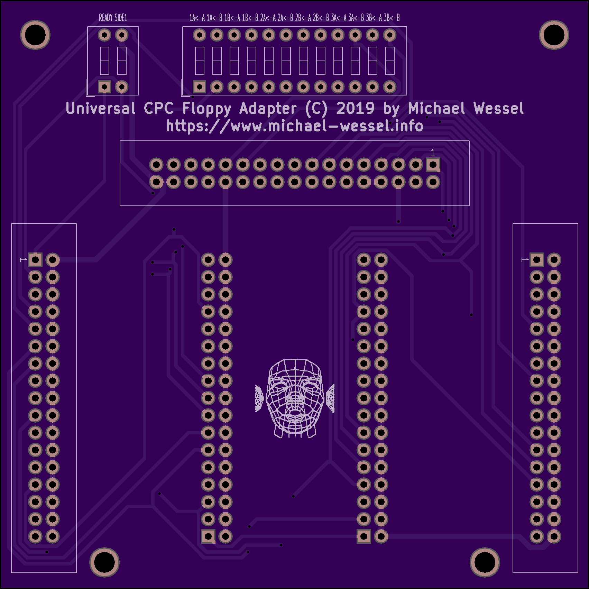
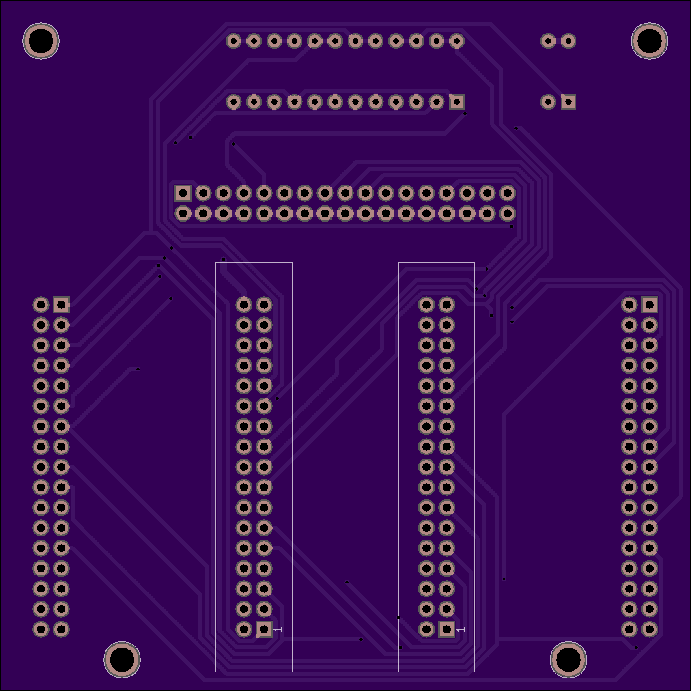
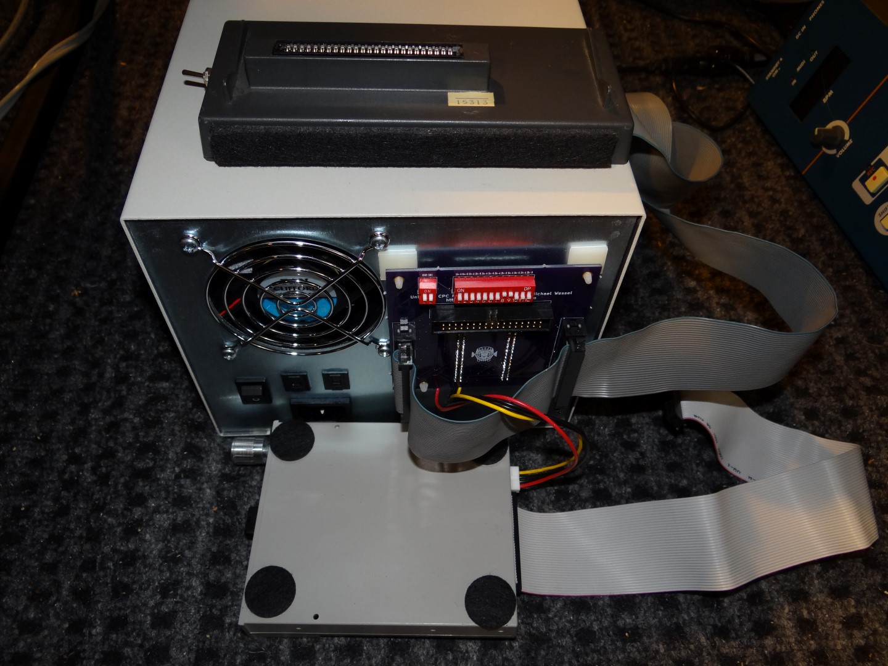
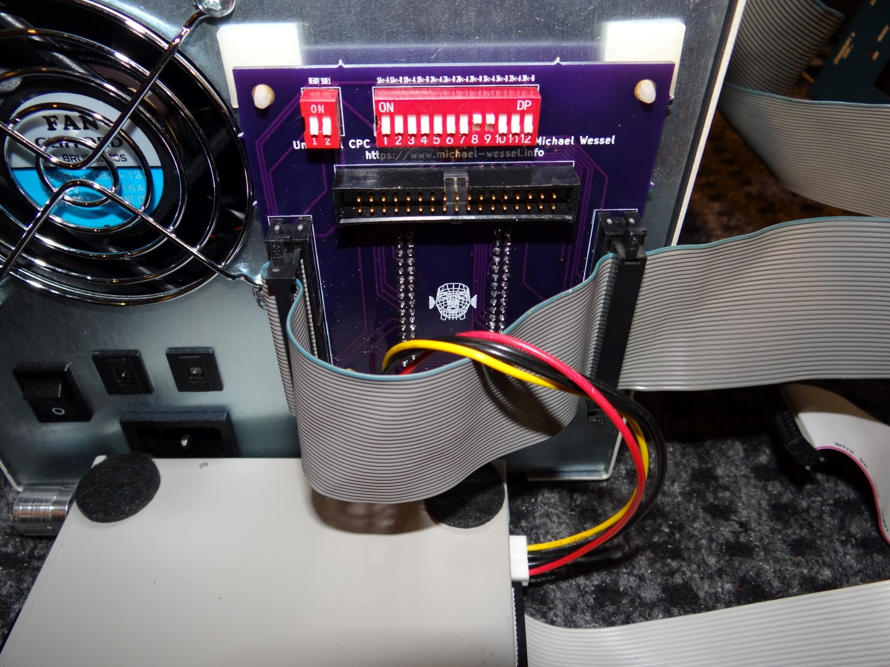
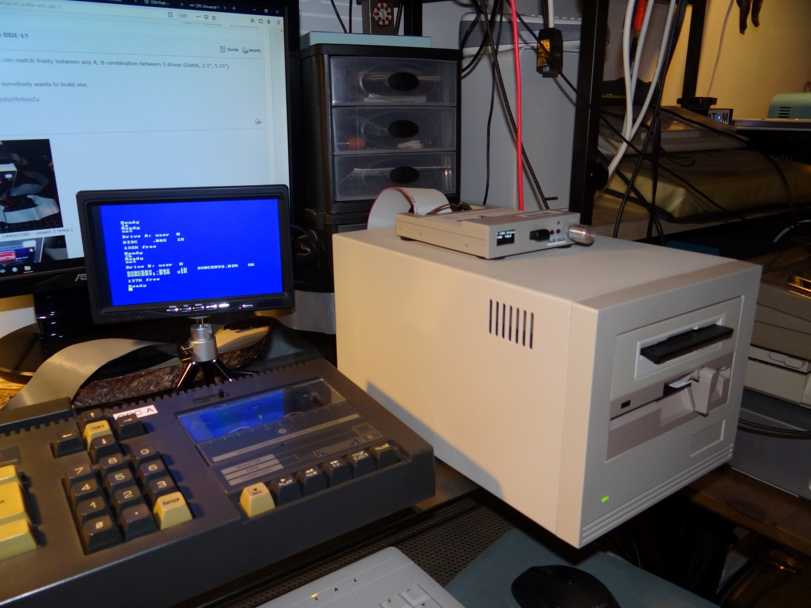
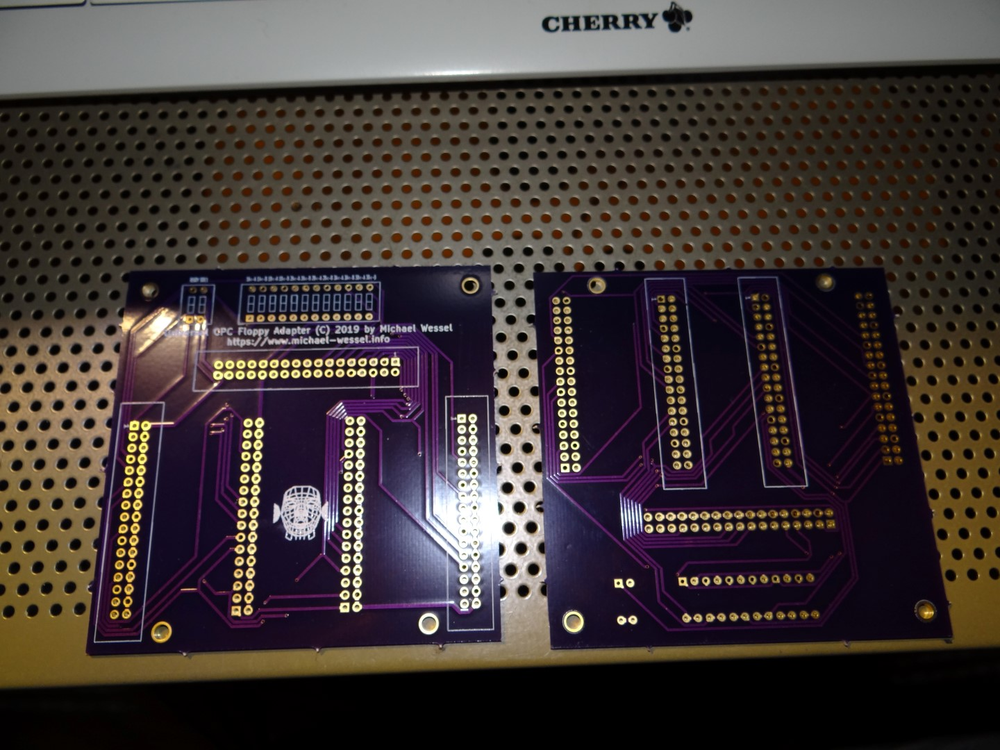
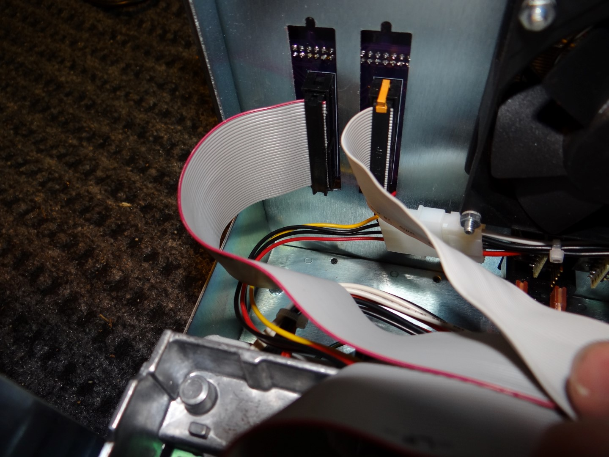

# CPCDiskAdapter
A Universal Floppy Disk Drive Adapter for the Amstrad / Schneider CPC 464 

## Purpose 

A versatile floppy disk drive adapter board for the Amstrad /
Schneider CPC.  This printed circuit board (PCB) is primarily intended
for the CPC 464.

The Gerbers are [here.](gerbers.zip) 

Connecting disk drives other than the standard Amstrad DD1 / DF1
drives to the CPC via the DDI-1 disk controller usually requires some
floppy cable mods. Moreover, these mods usually fix the drive 
to either being CPC A or B drive.  

With this adapter board, one can flexibly use the DIP switches to
select 2 out of 3 possible disk drives, and flexibly determine which
one is A or B. Moreover, no more (destructive) cable mods are required
with this board.

The following drives can be used: 

- the standard Amstrad DD1 / FD1 3" floppy
- standard PC 3.5" floppy (with READY signal if possible) 
- 5.25" floppy (with READY signal if possible) 
- Gotek floppy drive

If the drive does no emit the READY signal, then it can be "faked" by
grounding the READY line with the corresponding READY DIP switch
(this is a standard CPC floppy cable hack). 

The pictures show an application example - I am using the Amstrad DDI-1
disk controller and an old 2bay SCSI enclosure. 

[Check out the schematics.](schematics.pdf)

Notice that the sockets labeled **I1 and I2 are the input sockets for the Amstrad DDI-1 connectors** - in case of the DDI-1 controller,  both of these need to be used, in order to recover the A (DS0) and B (DS1) drive selection lines. With a different controller it may be sufficient to only use one of these sockets. Also, **O1, O2, and O3 are output sockets** and are used for connecting the drives. Moreover,  **5V is not supplied over the adapter.**  

## Using the Amstrad DDI-1 Disk Controller 

Please note that by default / factory setting, **the DDI-1 is powered by the DD1 / DF1 3" disk drive**. However, this adapter DOES NOT connect the 5V power lines in order to protect other drives - powering drives over the ribbon cable was an proprietary Amstrad invention, and can destroy drives such as the Gotek. Hence, in order to be able to use the DDI-1 with this adapter board, a **DDI-1 modification has to be applied: the DDI-1 has to be powered by the CPC expansion bus.**  This [modification is described here.](http://www.cpcwiki.eu/index.php/DDI_Modification]). 

I recommend putting a switch in the DDI-1 such that the mod can be en- and disabled as needed. 

## Application Examples 

